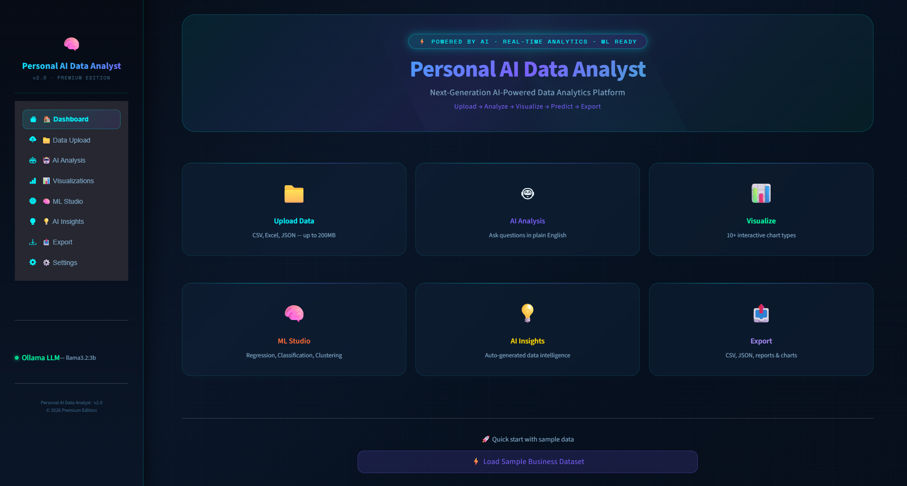
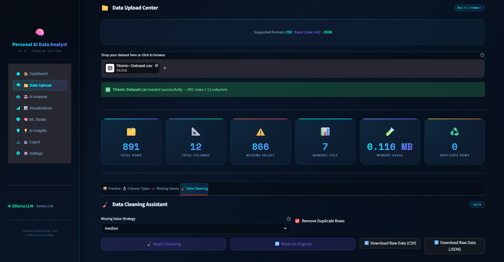
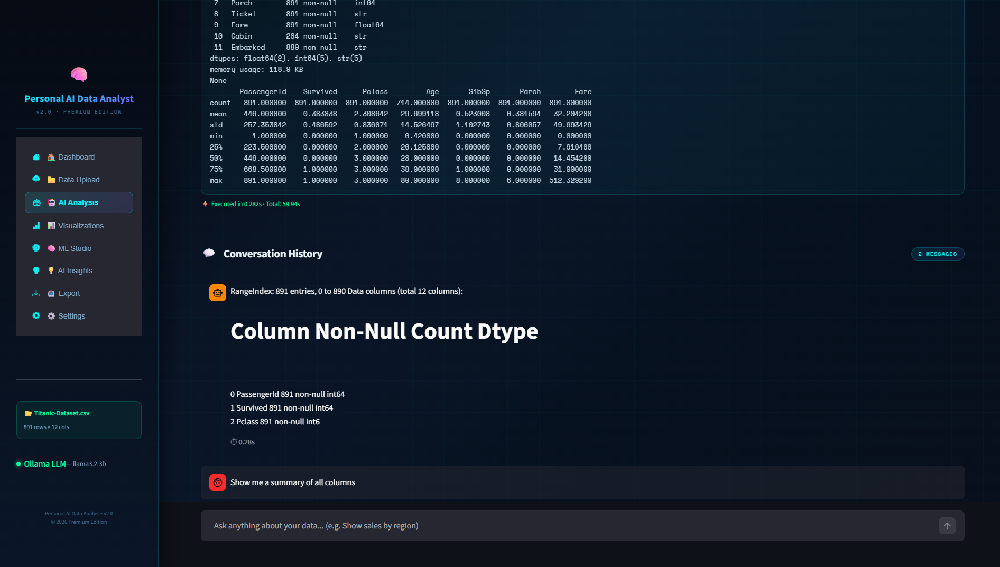
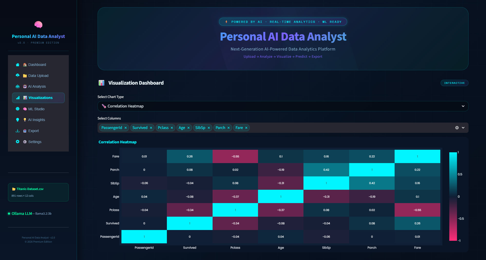
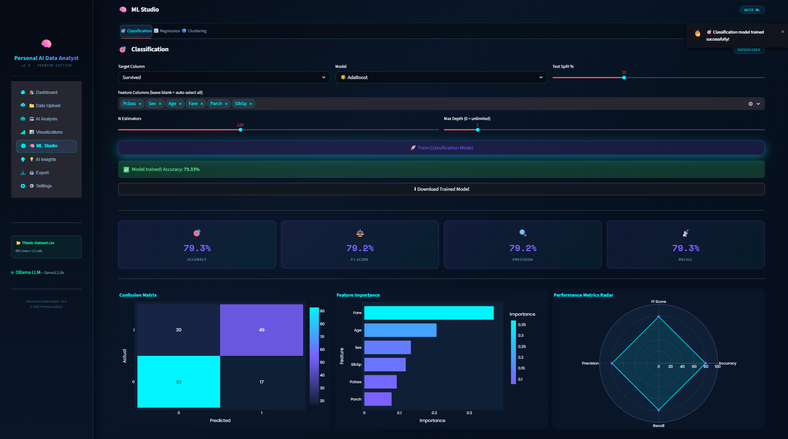
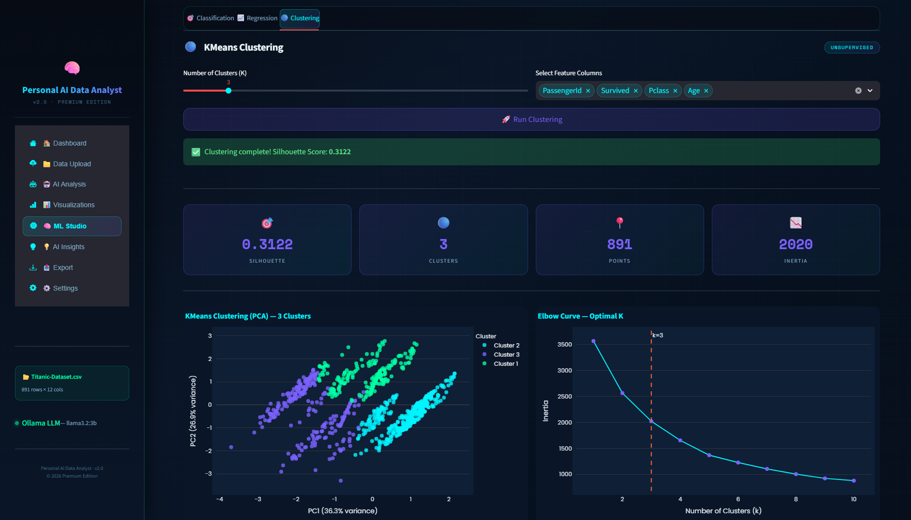

<div align="center">

# 🧠 Personal AI Data Analyst
### Next-Generation AI-Powered Data Analytics Platform


**Upload → Analyze → Visualize → Predict → Export**

*A premium AI-powered analytics platform that combines AI, Machine Learning,*
*and Interactive Data Visualization into one intelligent system.*

</div>

---

## 📋 Table of Contents

1. [Project Overview](#-project-overview)
2. [Features](#-features)
3. [Project Structure](#-project-structure)
4. [Tech Stack](#-tech-stack)
5. [Prerequisites](#-prerequisites)
6. [VS Code Setup](#-vs-code-setup)
7. [Virtual Environment Setup](#-virtual-environment-setup)
8. [Installing Dependencies](#-installing-dependencies)
9. [Ollama Setup](#-ollama-setup-ai-engine)
10. [Running the App](#-running-the-app)
11. [How to Use](#-how-to-use)
12. [Example Queries](#-example-queries)
13. [ML Models Used](#-ml-models-used)
14. [Troubleshooting](#-troubleshooting)
15. [Future Improvements](#-future-improvements)
16. [Author](#-author)
17. [License](#-license)

---

## 🎯 Project Overview

**Personal AI Data Analyst** is a fully functional, production-quality AI-powered data analytics platform built using Python and Streamlit.

The platform enables users to:
- Upload datasets (CSV, Excel, JSON)
- Analyze data using **natural language questions**
- Generate **interactive visualizations** with 10+ chart types
- Train **machine learning models** with one click
- Obtain **AI-generated insights** using a locally running LLM (Llama 3.2 via Ollama)
- **Export** reports, predictions, and charts

The platform combines:

| Component | Description |
|-----------|-------------|
| 📊 Data Analytics | Statistical summaries, profiling, correlation |
| 📈 Interactive Visualizations | 10+ Plotly chart types |
| 🤖 AI-Powered Insights | Local LLM via Ollama |
| 🧠 Machine Learning | Classification, Regression, Clustering |
| 🔐 Safe Code Execution | Sandboxed Python execution engine |
| 📁 Export & Reporting | CSV, JSON, HTML, TXT reports |

---

## ✨ Features

### 📁 Data Upload
- Upload **CSV**, **Excel (.xlsx / .xls)**, and **JSON** files
- Auto-detects column types (numeric, categorical, datetime)
- Multi-encoding support (UTF-8, Latin-1, CP1252)
- Dataset profiling — shape, memory, missing values, duplicates
- Data cleaning assistant — imputation, deduplication

### 🗃️ Data Overview
- Animated KPI metric cards (rows, columns, missing %, memory, duplicates)
- Interactive searchable, filterable, paginated data table
- Per-column profiler with statistics, skewness, kurtosis, outlier counts

### 🤖 AI Analysis Engine
- **Natural Language → Python Code → Result** pipeline
- Powered by **Ollama + Llama 3.2 3B** (100% local, fully private)
- Context-aware prompt suggestions from your actual column names
- Conversation history with chat-bubble style UI
- Safe sandboxed code execution (blocks os, subprocess, file access)
- Built-in Manual Code Editor for advanced users
- Works **offline** without Ollama for rule-based analysis

### 📊 Interactive Visualizations (10+ Types)

| Chart Type | Description |
|------------|-------------|
| Histogram | Distribution with box plot marginal |
| Scatter Plot | With color grouping + OLS trendline |
| Correlation Heatmap | Full numeric correlation matrix |
| Box Plot | With outlier points + notch |
| Pie / Donut Chart | Category distribution |
| Bar Chart | Grouped, colored, horizontal/vertical |
| Violin Plot | Distribution + density by category |
| Time Series | Line + area fill over time |
| Distribution Plot | Overlapping KDE histograms |
| Missing Value Heatmap | Pattern of missing data |
| Outlier Plot | IQR and Z-score based |

### 🧠 ML Studio

**Classification Models:**
- Random Forest Classifier
- Logistic Regression
- Decision Tree Classifier
- Gradient Boosting Classifier

**Regression Models:**
- Linear Regression
- Random Forest Regressor
- Decision Tree Regressor
- Ridge Regression
- Lasso Regression

**Clustering:**
- KMeans Clustering with Elbow Curve
- PCA 2D Visualization
- Silhouette Score evaluation

**ML Features:**
- Automatic feature engineering (label encoding, imputation, scaling)
- Configurable train/test split
- Confusion matrix visualization
- Classification report
- Feature importance charts
- Radar chart of performance metrics
- Actual vs Predicted plots (regression)
- Residuals distribution chart
- Download predictions as CSV

### 💡 AI Insights Engine
- Rule-based insights (always available, no LLM required)
- LLM-powered narrative insights (requires Ollama)
- Outlier detection — IQR and Z-score methods
- Missing value analysis with heatmap
- Correlation analysis with strength labels (Moderate / Strong / Very Strong)
- Automated statistical observations

### 📤 Export System
- Dataset → CSV or JSON
- ML predictions → CSV
- Last generated chart → Interactive HTML
- Full analytics report → TXT file
- Descriptive statistics → CSV

### 🔐 Security Features
- Safe sandboxed code execution engine
- Regex-based dangerous pattern blocking
- Timeout-protected execution (30s limit)
- Restricted built-in function namespace
- Blocks: `os.system`, `subprocess`, `shutil`, `socket`, `pickle`, `ctypes`

---

## 📁 Project Structure

```
personal_ai_data_analyst/
├── app.py
├── analyst.py
├── ml_engine.py
├── ui_components.py
├── utils.py
├── requirements.txt
├── README.md
├── assets/
│   └── styles.css
├── sample_data/
│   └── sample.csv
├── screenshots/
│   ├── dashboard.png
│   ├── upload.png
│   ├── ai_analysis.png
│   ├── visualization.png
│   ├── ml_studio.png
│   ├── confusion_matrix.png
│   ├── feature_importance.png
│   ├── ai_insights.png
│   ├── export_system.png
│   └── architecture.png
└── exports/          ← gitignore this (auto-created)
```
## 📸 Screenshots

&gt; Click any image to view in full resolution.

### 🏠 Dashboard — Welcome Screen
*Landing page with quick-access cards for all major features.*


---

### 📁 Data Upload — Titanic Dataset Loaded
*Multi-format upload with instant profiling, KPI cards, and column statistics.*


---

### 🤖 AI Analysis — Natural Language to Code
*Ask questions in plain English. The AI generates Python code and executes it live.*


---

### 📊 Visualization — Correlation Heatmap
*Interactive Plotly charts with dark theme. Explore relationships across all numeric columns.*


---

### 🧠 ML Studio — Classification with Full Metrics
*One-click model training: Gradient Boosting with confusion matrix, feature importance, and performance radar.*


---

### 🔵 ML Studio — KMeans Clustering
*Unsupervised learning with PCA visualization, elbow curve, and silhouette scoring.*


---

## 🛠️ Tech Stack

### 🐍 Core Language
| Technology | Version |
|------------|---------|
| Python | 3.10+ |

### 🎨 Frontend / UI
| Technology | Version | Purpose |
|------------|---------|---------|
| Streamlit | ≥1.32.0 | Web application framework |
| streamlit-option-menu | ≥0.3.6 | Premium sidebar navigation |
| Custom CSS | — | Glassmorphism dark theme, neon glow |
| Google Fonts | — | Poppins + Space Mono typography |

### 📊 Data Processing
| Technology | Version | Purpose |
|------------|---------|---------|
| Pandas | ≥2.0.0 | Data manipulation and profiling |
| NumPy | ≥1.24.0 | Numerical operations |
| SciPy | ≥1.11.0 | Statistical analysis |
| Statsmodels | ≥0.14.0 | Advanced statistical models |
| openpyxl | ≥3.1.0 | Excel file handling |

### 📈 Visualization
| Technology | Version | Purpose |
|------------|---------|---------|
| Plotly | ≥5.18.0 | All interactive charts |
| Plotly Express | ≥0.4.1 | High-level chart API |
| Matplotlib | ≥3.7.0 | Backend plotting |
| Seaborn | ≥0.12.0 | Statistical visualization |

### 🧠 Machine Learning
| Technology | Version | Purpose |
|------------|---------|---------|
| Scikit-learn | ≥1.3.0 | Full ML pipeline |
| Joblib | ≥1.3.0 | Model serialization |

### 🤖 AI / LLM
| Technology | Version | Purpose |
|------------|---------|---------|
| Ollama | Latest | Local LLM inference server |
| Llama 3.2 3B | 3b | Language model |
| Requests | ≥2.31.0 | HTTP calls to Ollama API |

### 🗂️ File Handling & Security
| Technology | Purpose |
|------------|---------|
| openpyxl | Excel read/write |
| Pillow (PIL) | Image processing |
| threading (stdlib) | Timeout protection |
| re (stdlib) | Regex pattern security |
| io (stdlib) | In-memory file streams |

---

## 🔧 Prerequisites

Before starting, make sure you have:

| Requirement | Version | Check Command |
|-------------|---------|---------------|
| Python | 3.10 or higher | `python --version` |
| pip | Latest | `pip --version` |
| VS Code | Any recent | — |
| Ollama | Latest | `ollama --version` |

> **Don't have Python?**
> Download from: https://www.python.org/downloads/
> During install on Windows: ✅ Check **"Add Python to PATH"**

---

## 💻 VS Code Setup

1. **Download VS Code:** https://code.visualstudio.com/

2. **Install recommended extensions:**
   - **Python** (by Microsoft) — syntax highlighting, IntelliSense
   - **Pylance** — type checking
   - **Rainbow CSV** — for viewing CSV files

3. **Open the project:**
   ```
   File → Open Folder → select your project folder
   ```

4. **Select Python interpreter:**
   - Press `Ctrl+Shift+P`
   - Type: `Python: Select Interpreter`
   - Choose your virtual environment

---

## 🐍 Virtual Environment Setup

> A virtual environment keeps project packages separate from your system Python.
> **Always use one.**

### Windows (PowerShell / CMD)
```bash
# Navigate to project folder
cd personal_ai_data_analyst

# Create virtual environment
python -m venv venv

# Activate it
venv\Scripts\activate

# You should now see (venv) in your terminal prompt ✅
```

### Mac / Linux
```bash
# Navigate to project folder
cd personal_ai_data_analyst

# Create virtual environment
python3 -m venv venv

# Activate it
source venv/bin/activate

# You should now see (venv) in your terminal prompt ✅
```

**To deactivate when done:**
```bash
deactivate
```

---

## 📦 Installing Dependencies

With your virtual environment **activated**, run:

```bash
pip install -r requirements.txt
```

> ⏱️ Takes approximately **3–7 minutes** on first install.

If you encounter errors:
```bash
# Upgrade pip first
pip install --upgrade pip

# Then retry
pip install -r requirements.txt
```

**Install sidebar navigation package (recommended):**
```bash
pip install streamlit-option-menu
```

---

## 🤖 Ollama Setup (AI Engine)

Ollama runs LLMs like Llama 3.2 **100% locally** on your machine.
No API key. No internet required after download. Your data stays private.

### Step 1 — Install Ollama

**Windows:**
```bash
winget install Ollama.Ollama
```
Or download directly from: https://ollama.ai/download

**Mac:**
```bash
brew install ollama
```

**Linux:**
```bash
curl -fsSL https://ollama.ai/install.sh | sh
```

---

### Step 2 — Start Ollama Server

Open a **separate terminal** and keep it running in the background:
```bash
ollama serve
```

Expected output:
```
Listening on 127.0.0.1:11434
```

---

### Step 3 — Download Llama 3.2 3B Model

In another terminal:
```bash
# Llama 3.2 3B (recommended — ~2GB, fast on most machines)
ollama pull llama3.2:3b
```

---

### Step 4 — Verify Installation

```bash
ollama list
```

Expected output:
```
NAME              ID              SIZE    MODIFIED
llama3.2:3b       ...             2.0 GB  ...
```

> **Note:** The app works fully **without Ollama** too!
> Visualizations, ML Studio, and rule-based insights all work offline.
> Only the AI natural language chat feature requires Ollama.

---

## 🚀 Running the App

Make sure your virtual environment is activated and (optionally) Ollama is running, then:

```bash
streamlit run app.py
```

The app opens automatically at:
```
http://localhost:8501
```

If it doesn't open automatically, copy the URL from the terminal into your browser.

**To stop the app:** Press `Ctrl+C` in the terminal.

---

## 📖 How to Use

### ⚡ Quick Start (30 seconds)

1. Click **"⚡ Load Sample Business Dataset"** on the Dashboard
2. Explore the **Dashboard** — KPI cards, data preview, auto insights
3. Go to **📊 Visualizations** — pick any chart type and explore
4. Go to **🧠 ML Studio** — select a target column and click Train
5. Go to **🤖 AI Analysis** — type any question about your data

### 📁 Upload Your Own Data

1. Navigate to **📁 Data Upload** in the sidebar
2. Click the upload area or drag and drop your file
3. Supported formats: `.csv` `.xlsx` `.xls` `.json`
4. Dataset loads automatically with full profiling

### 🤖 Ask AI Questions

1. Go to **🤖 AI Analysis**
2. Ensure Ollama is running (`ollama serve` in a separate terminal)
3. Type your question or click a suggestion chip
4. The AI generates Python code, executes it, and shows results

---

## 💬 Example Queries

Try these in the AI Analysis section:

```
Show me a summary of all columns
Show me duplicate rows
Show distribution of Age
Find outliers in the Fare column
Show correlation between Age and Fare
Group data by Sex and show average Fare
Which Pclass has the highest survival rate?
Show a bar chart of Survived by Sex
How many missing values are in each column?
What percentage of passengers survived?
Show top 10 rows by highest Fare
Plot Fare distribution by passenger class
```

---

## 🧠 ML Models Used

### Classification
| Model | Use Case |
|-------|----------|
| Random Forest | High accuracy, handles non-linearity |
| Logistic Regression | Binary/multiclass, interpretable |
| Decision Tree | Visual, easy to explain |
| Gradient Boosting | High performance ensemble |

### Regression
| Model | Use Case |
|-------|----------|
| Linear Regression | Simple linear relationships |
| Ridge Regression | Regularized, handles multicollinearity |
| Lasso Regression | Feature selection + regularization |
| Random Forest | Non-linear regression |
| Decision Tree | Non-linear, interpretable |

### Clustering
| Model | Use Case |
|-------|----------|
| KMeans | Segment data into K groups |
| PCA | Dimensionality reduction for visualization |

---

## 🔧 Troubleshooting

### ❌ `ModuleNotFoundError`
```bash
# Ensure venv is activated, then:
pip install -r requirements.txt
```

### ❌ `streamlit: command not found`
```bash
python -m streamlit run app.py
```

### ❌ Ollama not connecting
```bash
# Start Ollama server in a separate terminal:
ollama serve

# Verify it's running:
curl http://localhost:11434/api/tags
```

### ❌ Model not found error
```bash
ollama pull llama3.2:3b
ollama list  # verify it appears
```

### ❌ `ImportError: __import__ not found`
- This is a sandbox execution bug — already fixed in `analyst.py`
- Make sure you're using the latest version of `analyst.py`

### ❌ Charts not rendering
- Verify Plotly is installed: `pip install plotly`
- Refresh your browser tab
- Check the terminal for Python errors

### ❌ File upload fails
- Save your CSV with UTF-8 encoding
- Remove special characters from column names
- Keep file size under 200MB

### ❌ ML training fails
- Target column needs ≥10 samples per class
- For classification: target should have ≤20 unique values
- Drop columns with >50% missing values first (use Data Cleaning tab)

### ❌ CSS not loading (plain/white UI)
- Make sure `assets/styles.css` exists
- Run the app from the project root directory (same folder as `app.py`)

### ❌ `NameError` in AI Analysis
- The LLM generated a bad variable name — this happens occasionally
- Click the query again or rephrase slightly
- The sanitizer in `analyst.py` handles most cases automatically

---

## 🔮 Future Improvements

- [ ] Multi-file upload — merge and join datasets
- [ ] AutoML — automatic model selection and hyperparameter tuning
- [ ] Natural language SQL — DuckDB integration
- [ ] PDF report export — professional PDF with all charts
- [ ] User authentication — multi-user session support
- [ ] Cloud deployment — Streamlit Cloud / Docker
- [ ] Forecasting — ARIMA, Prophet for time series prediction
- [ ] Voice-based querying — speak your questions
- [ ] Real-time streaming analytics
- [ ] GPU acceleration support
- [ ] More LLM integrations (GPT-4, Gemini, Claude)
- [ ] Dashboard sharing and collaboration

---

## 👨‍💻 Author

<div align="center">

### **B Taraka Ratna**
#### MSc Data Science — Final Year Project

*Personal AI Data Analyst — Intelligent AI-Powered Data Analytics Platform*

</div>

---

## 📄 License

This project is developed for **educational and academic purposes** under the MIT License.
Free to use, modify, and distribute with attribution.

---

## 🙏 Acknowledgements

Built with the following open-source tools and communities:

- [Streamlit](https://streamlit.io/) — Web application framework
- [Plotly](https://plotly.com/) — Interactive visualization library
- [Pandas](https://pandas.pydata.org/) — Data manipulation
- [Scikit-learn](https://scikit-learn.org/) — Machine learning library
- [Ollama](https://ollama.ai/) — Local LLM inference
- [Meta Llama](https://llama.meta.com/) — Open-source language model
- The entire **Open Source Community** ❤️

---

<div align="center">

⭐ **Personal AI Data Analyst** ⭐

*AI-Powered Analytics • Machine Learning • Interactive Visualization • Local LLM Intelligence*

**Made with ❤️ and ☕ by B Taraka Ratna**

</div>
